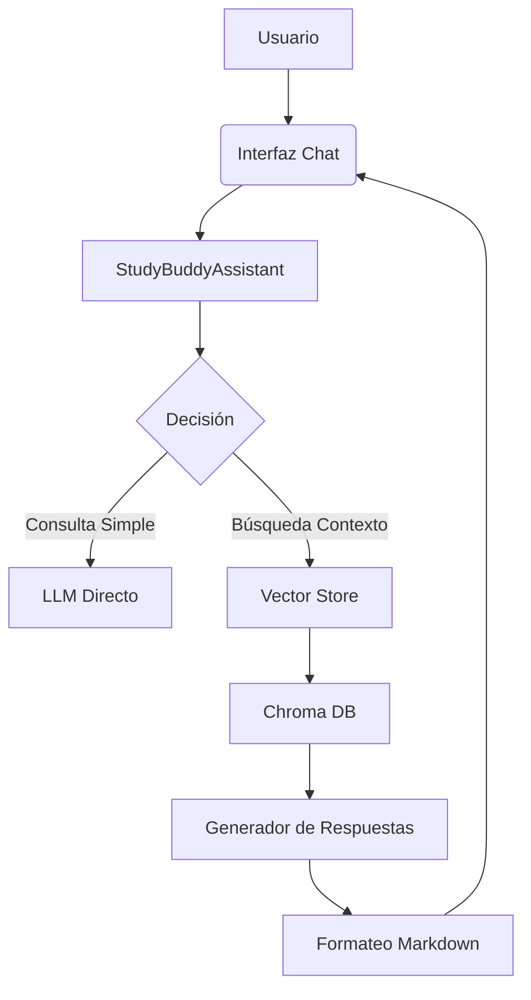

# StudyBuddy  

**Autores:**

- Vázquez Martínez Fredin Alberto  

- García Díaz Aleksei Ithan

- Castañeda Mora Carlos

StudyBuddy ofrece una interfaz gráfica de usuario (GUI) intuitiva y fácil de usar construida con **Streamlit**. Esta interfaz permite a los usuarios interactuar con el asistente de estudio de manera visual y sin necesidad de escribir código Python directamente.

## Diagrama de Arquitectura  



**Características de la Interfaz Gráfica:**

* **Barra Lateral de Configuración:**
    * **Selección de Modelo LLM:** Permite elegir entre diferentes modelos de lenguaje grandes (LLMs) disponibles a través de Ollama (por ejemplo, `llama3.2`, `mistral`).
    * **Selección de Modelo de Embeddings:** Permite seleccionar el modelo utilizado para generar las representaciones vectoriales de los documentos (por ejemplo, `nomic-embed-text:latest`, `all-MiniLM-L6-v2`).
    * **Carga de Documentos PDF:** Una sección dedicada para que los usuarios carguen sus archivos PDF directamente desde su computadora. Los archivos cargados se guardan en la carpeta `pdfs_notes`.
    * **Indicador de Carga:** Muestra mensajes de éxito al cargar los documentos.
    * **Información:** Proporciona instrucciones claras sobre cómo cargar los documentos.

* **Área de Chat:**
    * **Historial de Conversación:** Muestra la conversación completa entre el usuario y StudyBuddy, con burbujas de chat diferenciadas para el usuario y el asistente.
    * **Campo de Entrada de Preguntas:** Un cuadro de texto donde los usuarios pueden escribir sus preguntas o solicitudes al asistente.
    * **Visualización en Tiempo Real:** La respuesta del asistente se muestra de forma progresiva (streaming) a medida que se genera.

**Cómo Iniciar la Interfaz Gráfica:**

1.  Asegúrate de tener instalado Streamlit. Si no lo tienes, ejecuta:
    ```bash
    pip install streamlit
    ```
2.  Guarda el código de la interfaz gráfica (proporcionado anteriormente como `main_interface.py`) en el mismo directorio que tu archivo `StudyBuddy.py` y la carpeta `pdfs_notes`.
3.  Abre tu terminal o símbolo del sistema, navega hasta este directorio y ejecuta el siguiente comando:
    ```bash
    streamlit run main_interface.py
    ```
4.  Streamlit abrirá automáticamente la aplicación StudyBuddy en tu navegador web.

**Uso de la Interfaz Gráfica:**

1.  En la barra lateral, selecciona el modelo LLM y el modelo de embeddings que deseas utilizar.
2.  Haz clic en el botón "Carga tus documentos PDF aquí:" y selecciona los archivos PDF de tus apuntes. Los archivos se guardarán en la carpeta `pdfs_notes`.
3.  En el área de chat, escribe tu pregunta en el campo de entrada y presiona Enter.
4.  La respuesta de StudyBuddy se mostrará en el área de chat. Puedes seguir haciendo preguntas relacionadas o nuevas.

## Explicaciones Técnicas

StudyBuddy utiliza una arquitectura de Recuperación Aumentada con Generación (RAG) para responder a las preguntas de los usuarios basándose en sus documentos personales. A continuación, se detallan los componentes clave y el flujo del proceso:

1.  **Carga de Documentos (`_load_documents`):**
    * El sistema carga automáticamente todos los archivos con extensión `.pdf` que se encuentran en la carpeta `pdfs_notes`.
    * Se utiliza la librería `PyMuPDFLoader` para extraer el texto de los archivos PDF.

2.  **División del Texto (`RecursiveCharacterTextSplitter`):**
    * Los documentos cargados se dividen en fragmentos de texto más pequeños (chunks) para facilitar la búsqueda y el procesamiento.
    * Se utiliza `RecursiveCharacterTextSplitter` con un tamaño de chunk de 1000 caracteres y un solapamiento de 200 caracteres para mantener el contexto entre los fragmentos.

3.  **Generación de Embeddings (`OllamaEmbeddings`):**
    * Cada fragmento de texto se convierte en un vector de embeddings utilizando el modelo especificado (`embedding_model`) a través de `OllamaEmbeddings`. Los embeddings son representaciones numéricas del significado semántico del texto.

4.  **Almacenamiento Vectorial (`Chroma`):**
    * Los embeddings generados se almacenan en una base de datos vectorial local llamada `Chroma`. Esto permite realizar búsquedas semánticas eficientes.
    * La base de datos vectorial se guarda en la carpeta `documents_vector_db` para su persistencia.

5.  **Recuperación de Contexto (`_retrieve_tool`):**
    * Cuando el usuario hace una pregunta, la pregunta también se convierte en un vector de embeddings utilizando el mismo modelo.
    * Se realiza una búsqueda de similitud en la base de datos vectorial para encontrar los fragmentos de texto más relevantes para la pregunta del usuario.

6.  **Generación de Respuesta (`ChatOllama`, `_generate_response`):**
    * Los fragmentos de texto recuperados se utilizan como contexto adicional para el modelo de lenguaje grande (`model_name`) ejecutado a través de Ollama.
    * Se utiliza un prompt cuidadosamente diseñado para instruir al LLM a responder la pregunta del usuario basándose en el contexto proporcionado. El prompt incluye directrices sobre el rol del asistente, las limitaciones (usar solo el contexto), y las funcionalidades principales (resúmenes, explicaciones, preguntas de práctica).
    * La respuesta generada por el LLM se formatea en Markdown para una mejor presentación.

7.  **Flujo de Trabajo (`StateGraph`):**
    * Se utiliza `LangGraph` para definir un flujo de trabajo en varios pasos:
        * `query_or_respond`: Decide si la pregunta requiere buscar en el contexto o se puede responder directamente.
        * `tools`: Si se necesita contexto, se llama a la herramienta de recuperación (`_retrieve_tool`).
        * `generate`: Se utiliza el contexto recuperado (si existe) para generar la respuesta con el LLM.

## Estructura del Proyecto

La estructura del proyecto es la siguiente:

```
StudyBuddy/
├── pdfs_notes/             # Carpeta donde el usuario guarda sus archivos PDF
├── documents_vector_db/    # Carpeta donde se guarda la base de datos vectorial Chroma
├── StudyBuddy.py           # Archivo con la lógica principal del asistente StudyBuddy
└── main_interface.py       # Archivo con la interfaz gráfica de Streamlit
```

**Descripción de los Archivos:**

* **`pdfs_notes/`:** Este directorio está destinado a contener los archivos PDF de los apuntes y documentos personales del usuario. La aplicación leerá los archivos de esta carpeta.
* **`documents_vector_db/`:** Este directorio contendrá los archivos de la base de datos vectorial Chroma, que almacena los embeddings de los documentos para una búsqueda eficiente.
* **`StudyBuddy.py`:** Este archivo contiene la clase `StudyBuddyAssistant`, que implementa la lógica principal del asistente de estudio, incluyendo la carga de documentos, la creación de embeddings, la búsqueda en la base de datos vectorial y la generación de respuestas utilizando el LLM.
* **`main_interface.py`:** Este archivo contiene el código para la interfaz gráfica de usuario construida con Streamlit. Permite a los usuarios interactuar con `StudyBuddyAssistant` a través de un navegador web, cargar sus documentos y hacer preguntas.


